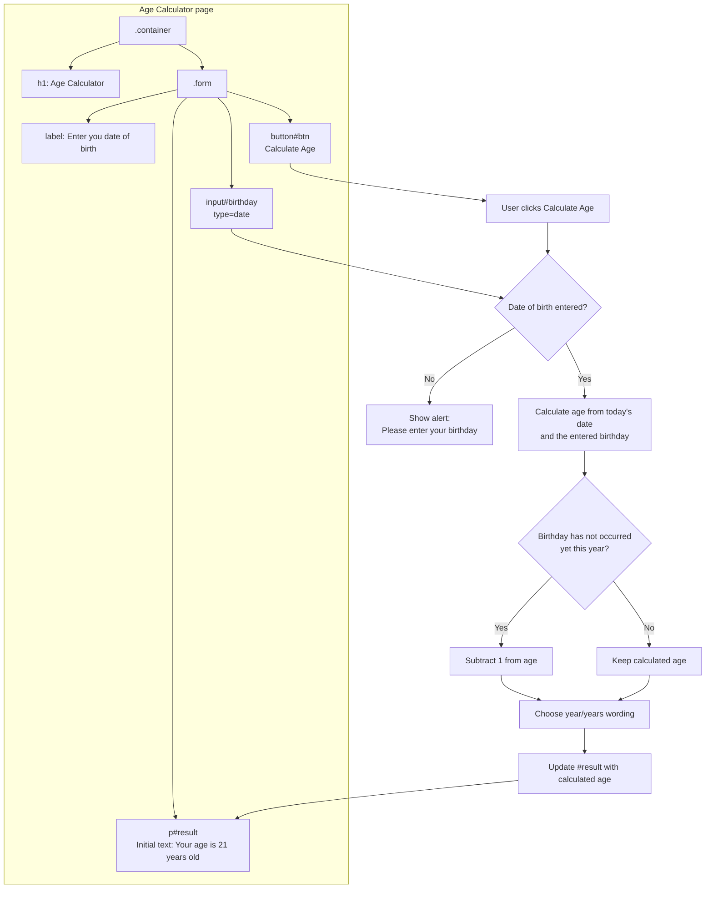

# Age Calculator Diagram

```mermaid
flowchart TD
    subgraph Page["Age Calculator page"]
        Container[".container"]
        Heading["h1: Age Calculator"]
        Form[".form"]
        Label["label: Enter you date of birth"]
        Birthday["input#birthday<br/>type=date"]
        Button["button#btn<br/>Calculate Age"]
        Result["p#result<br/>Initial text: Your age is 21 years old"]

        Container --> Heading
        Container --> Form
        Form --> Label
        Form --> Birthday
        Form --> Button
        Form --> Result
    end

    Click["User clicks Calculate Age"] --> Empty{"Date of birth entered?"}
    Empty -- No --> Alert["Show alert:<br/>Please enter your birthday"]
    Empty -- Yes --> Age["Calculate age from today's date<br/>and the entered birthday"]
    Age --> BeforeBirthday{"Birthday has not occurred<br/>yet this year?"}
    BeforeBirthday -- Yes --> Subtract["Subtract 1 from age"]
    BeforeBirthday -- No --> Keep["Keep calculated age"]
    Subtract --> Format["Choose year/years wording"]
    Keep --> Format
    Format --> Update["Update #result with calculated age"]
    Button --> Click
    Birthday --> Empty
    Update --> Result
```
